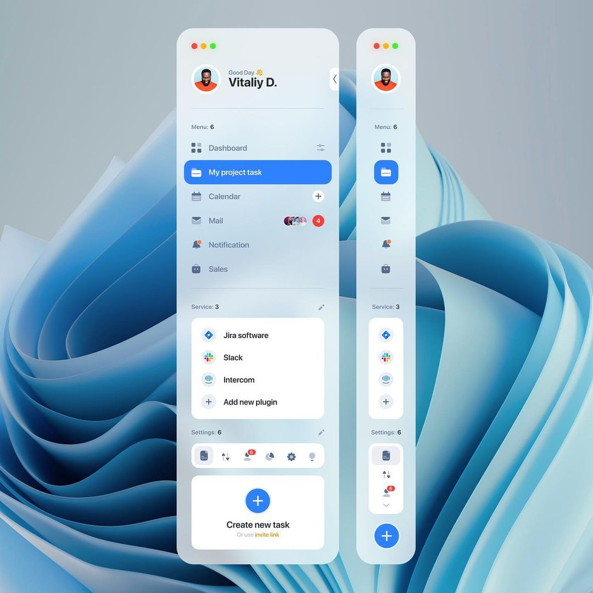

# Desktop Sidebar developed with Flutter <a href="https://flutter.dev" target="_blank" rel="noreferrer"> </a>
💭 UI Inspiration:  [Instagram](https://www.instagram.com/p/C1ZcpgGveNL/?igsh=MXhxcHl1ZHp6cWFpaQ%3D%3D)

## 📸 Screenshots


## 📹 Demo (Click to watch)
[](https://www.youtube.com/watch?v=J60bVIyWbPE)

## Packages & Libraries Used

* [Flutter SVG](https://github.com/dnfield/flutter_svg) (SVG rendering)
* [Flutter Hooks](https://github.com/rrousselGit/flutter_hooks/tree/master/packages/flutter_hooks) (Hooks for Flutter)
* [Hooks Riverpod](https://github.com/rrousselGit/riverpod) (Reactive State management)
* [Flutter Animate](https://github.com/gskinner/flutter_animate) (Animation)
* [Animate Gradient](https://github.com/Vikaskumar75/Animated-Gradient) (Gradient Animation)

## Getting Started

This project is a starting point for a Flutter application.

A few resources to get you started if this is your first Flutter project:

- [Lab: Write your first Flutter app](https://docs.flutter.dev/get-started/codelab)
- [Cookbook: Useful Flutter samples](https://docs.flutter.dev/cookbook)

For help getting started with Flutter development, view the
[online documentation](https://docs.flutter.dev/), which offers tutorials,
samples, guidance on mobile development, and a full API reference.

## How to use

**Step 1**

Download or clone this repo by using the link below
```
https://github.com/enoch-aik/desktop_sidebar.git
```

**Step 2**

Go to project root and execute the following command in console to get the required dependencies:

```
flutter pub get
```

## Hide Generated Files

In-order to hide generated files, navigate to `Android Studio` -> `Preferences` -> `Editor` -> `File Types` and paste the below lines under `ignore files and folders` section: